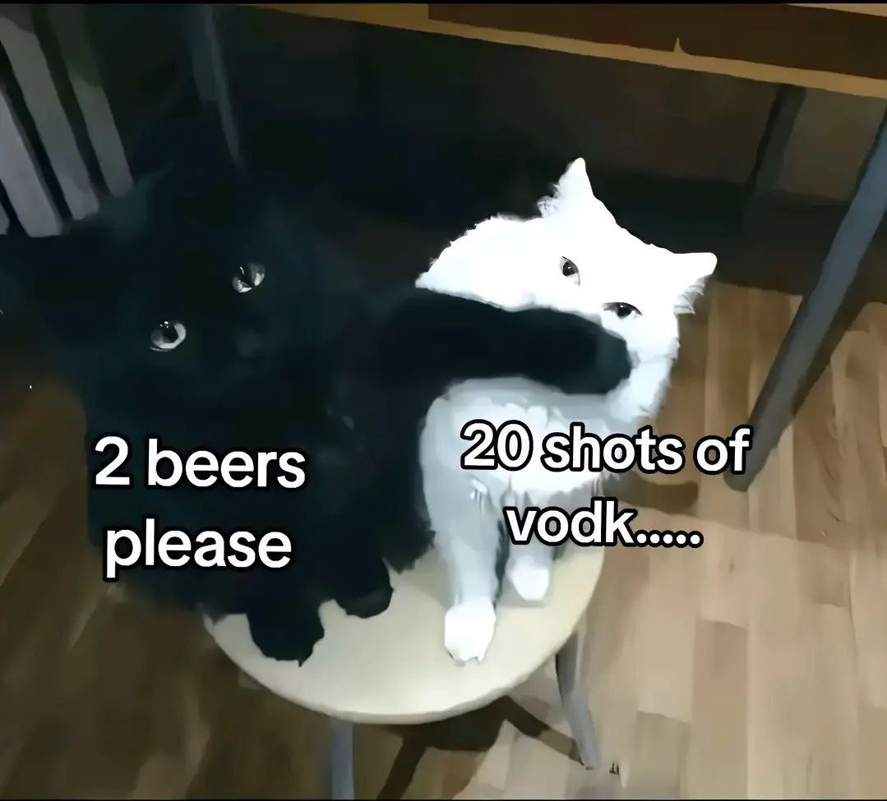

#Web-программирование
____
***ФИО:*** Никонов Алексей

***Группа:*** 6402-010302D

***Научный руководитель:*** Ильясова Наталья Юрьевна

***Потенциальная тема диплома:*** Разработка алгоритма машинного обучения для сегментации и количественной оценки композиционного состава тела на основе КТ-данных.
____
__Цитата:__

```
Надежда — хорошая вещь, может, лучшая из вещей. И хорошее никогда не умирает
```
@Энди Дюфрейн (Побег из Шоушенка)
____
