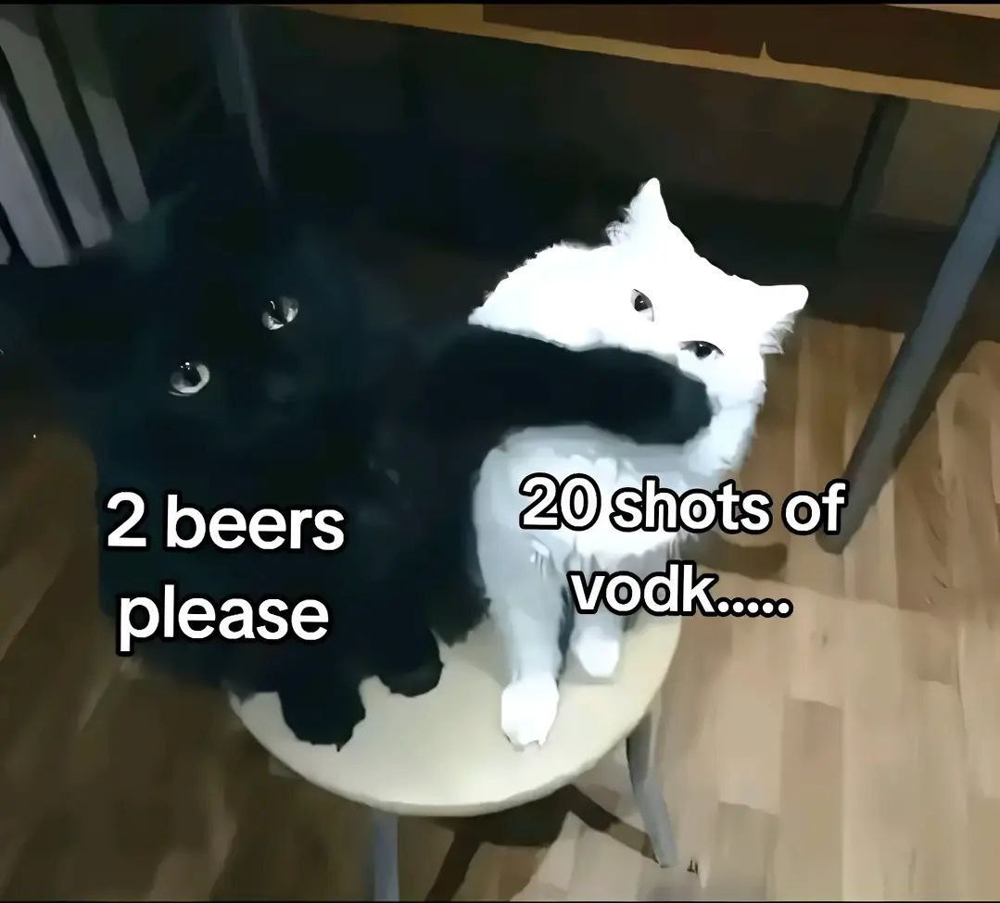

# Web-программирование
____
***ФИО:*** Никонов Алексей

***Группа:*** 6402-010302D

***Научный руководитель:*** Ильясова Наталья Юрьевна

***Потенциальная тема диплома:*** Разработка алгоритма машинного обучения для сегментации и количественной оценки композиционного состава тела на основе КТ-данных.
____
__Цитата:__

```
Надежда — хорошая вещь, может, лучшая из вещей. И хорошее никогда не умирает
```
@Энди Дюфрейн (Побег из Шоушенка)
____

____
# Лабораторная работа 2

**Требования к web-сайту:**

1.	Количество страниц – от 3 до 5. ✅
2.	Требования к HTML: 
    1.	Использование блочных и строчных элементов. ✅
    2.	Ссылки – от 1 шт. ✅
    3.	Картинки – от 1 шт. ✅
    4.	Таблица – от 1 шт. ✅
3.	Требование к CSS: 
    1.	Отдельный подключаемый файл.✅
    2.	Обязательное использование как минимум 3 видов селекторов.✅
    3.	Использование цвета.✅
    4.	Использование различных видов выравнивания в таблице (по левому/правому краю и по центру).✅
4.	Запрещено использовать JS, Bootstrap и любые другие библиотеки и фреймворки, всё реализовать самостоятельно.✅

____
# Лабораторная работа 3

1.	Загружен каркас проекта ✅
2.  Установлен node ✅
3.	Реализованы функции в core.js ✅  
4.  Отредактирован README ✅

____
# Лабораторная работа 4

Требования к web-сайту:
1.	Вёрстка с помощью Flexbox – 1 страница. ✅
2.	Вёрстка с помощью Grid – 1 страница. ✅
3.	Задание всех цветов только с помощью переменных в CSS. ✅
4.	Реализация анимации (красивой!) с помощью CSS – 1шт. ✅
5.	Реализация страницы с формой, включающей не менее 3 различных типов полей (например, страница авторизации с вводом логина, пароля и галочкой-согласием на обработку данных) и кнопку отправки данных на сервер. ✅
6.	Создание класса, содержащего конструктор и метод форматированного вывода на консоль. При нажатии на кнопку отправки данных на сервер должен создаваться объект, хранящий введённые данные, после чего вызывается метод вывода на консоль. ✅

____